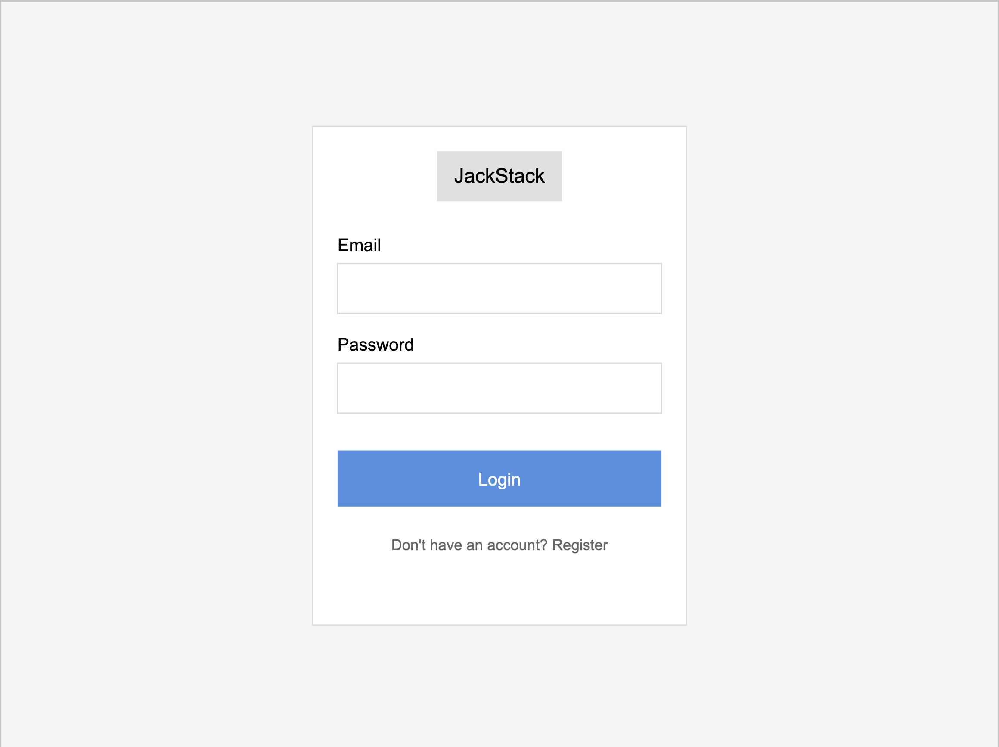
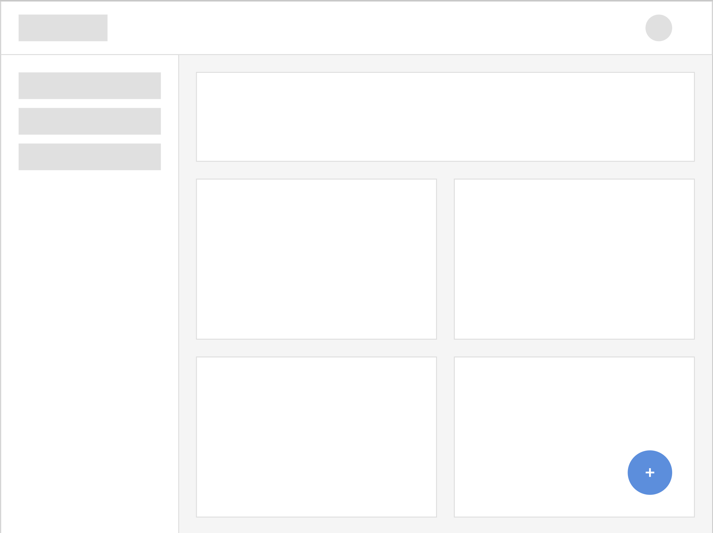
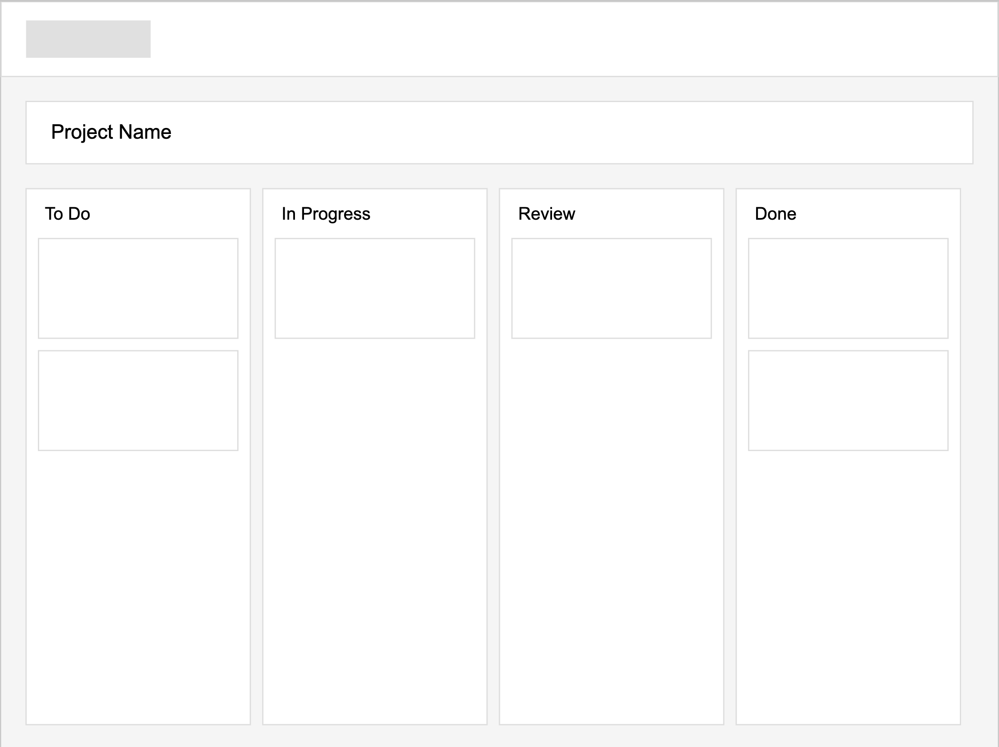
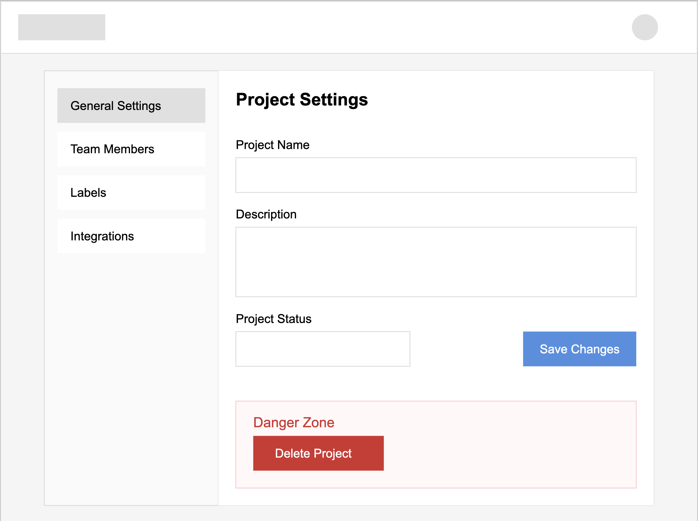
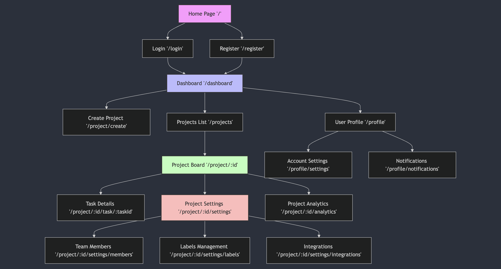

# JackStack - Project Management Tool

## Overview

Managing projects and team collaboration effectively can be challenging without proper tools and organization. That's where JackStack comes in!

JackStack is a web-based project management application built on the MERN stack that helps teams collaborate efficiently. Users can create projects, manage tasks using a Kanban board interface, track progress, and communicate in real-time. The application provides features like drag-and-drop task management, real-time updates, task assignments, and project analytics.

## Data Model

The application will store Users, Projects, Tasks, and Comments

* Users can have multiple projects (via references)
* Projects can have multiple tasks (via references)
* Tasks can have multiple comments (by embedding)
* Tasks can be assigned to users (via references)

### Example Documents:

An Example User:
```javascript
{
  username: "johndoe",
  email: "john@example.com",
  hash: // password hash,
  avatar: "url_to_avatar",
  projects: // array of references to Project documents
  createdAt: // timestamp
}
```
An Example Project:
```javascript
{
  name: "Website Redesign",
  description: "Redesign company website with new branding",
  owner: // reference to User object
  members: // array of references to User objects,
  status: "active",
  createdAt: // timestamp,
  updatedAt: // timestamp
}
```
An Example Task:
```javascript 
{
  project: // reference to Project object
  title: "Design Homepage Mockup",
  description: "Create initial mockup for homepage design",
  status: "in-progress", // ["todo", "in-progress", "review", "done"]
  priority: "high", // ["low", "medium", "high"]
  assignee: // reference to User object
  creator: // reference to User object
  dueDate: // date
  position: 1, // position in the column
  labels: ["design", "frontend"],
  comments: [
    {
      user: // reference to User object,
      content: "First draft completed, need feedback",
      createdAt: // timestamp
    }
  ],
  createdAt: // timestamp,
  updatedAt: // timestamp
}
```

## [Link to Commented First Draft Schema](db.mjs)

## WireFrames 

/login - User authentication page 


/dashboard - Main dashboard showing all projects 


/project/:id - Project board with Kanban view
 

/project/:id/settings - Project settings page


## Site Map 


## User Stories or Use Cases 
1. As a new user, I can register for an account with my email and password 
2. As a registered user, I can log in to access my projects
3. As an user, I can create new projects and invite team members to contribute to these projects 
4. As an user, I can create tasks within a project 
5. As an user, I can assign tasks to team members 
6. As an user, I can drag and drop tasks between different status columns 
7. As an user, I can comment on tasks 
8. As an user, I can receive real-time updates when tasks are modified 
9. As an user, I can set due dates and priorities for tasks 
10. As an project owner, I can manage project settings and member access 

## Research Topics 
* (6 points) React with Hooks and Context API 
    * Using React as the frontend framework 
    * Implementation of complex state management using Context API 
    * Real-time updates and component lifecycle management using Hooks 
    * Building reusable components for task management 
    * Will require deployment considerations for frontend/backend separation 

* (3 points) Socket.io Integration 
    * Implementing real-time updates for task changes
    * Enabling live collaboration features 

* (2 points) Tailwind CSS Framework 
    * Using Tailwind for customized UI components 
    * Creating a custom theme to match project branding 
    * Implementing responsive design patterns 
    * Will show custom configuration in tailwind.config.js 

* (2 points) ESLint with Vite 
    * Implement ESLint for code quality and consistency 
    * Custom ESLint configuration for React/Node.js 
    * Integration with Vite build process 
    * Will demonstrate automatic linting on file changes 

13 points total out of 10 required points 

### Libraries/Packages to Use
* React (Frontend Framework)
* Socket.io (Real-time Communication)
* Tailwind CSS (Styling)
* react-beautiful-dnd (Drag and Drop)
* ESLint (Code Quality)
* Vite (Build Tool)

## [Link to Initial Main Project File](app.mjs)
